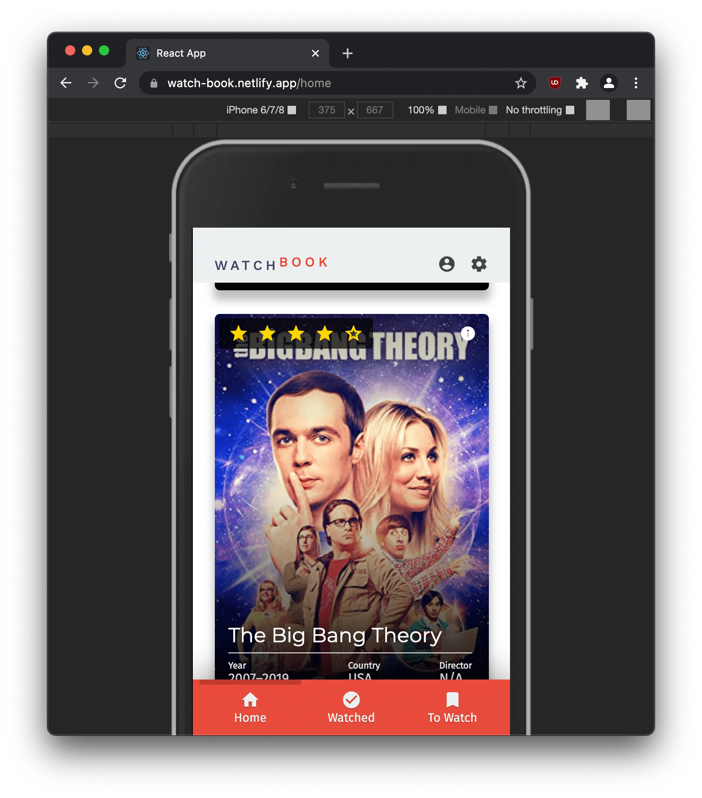
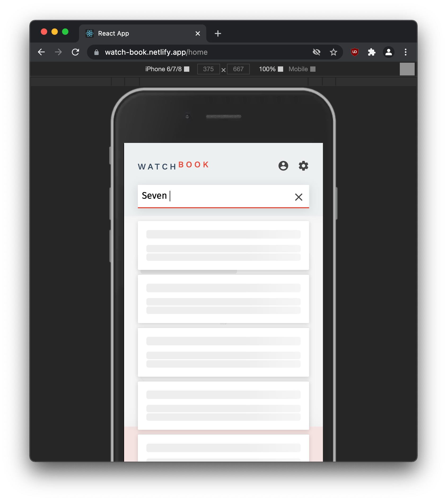
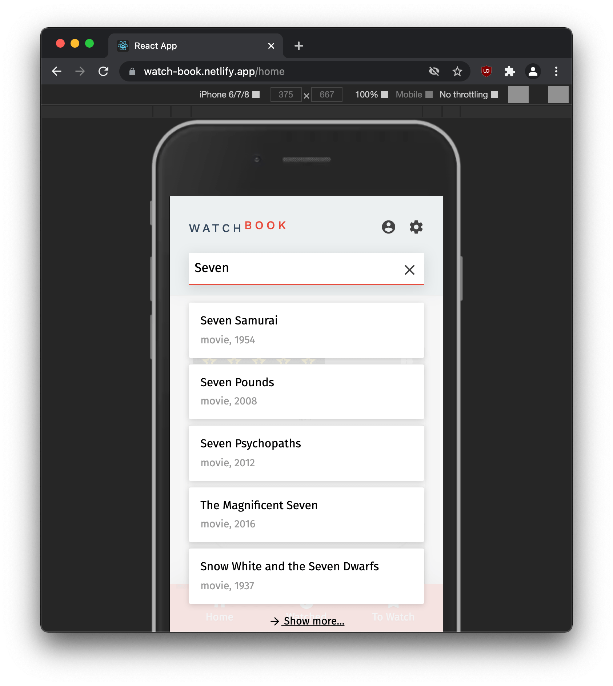
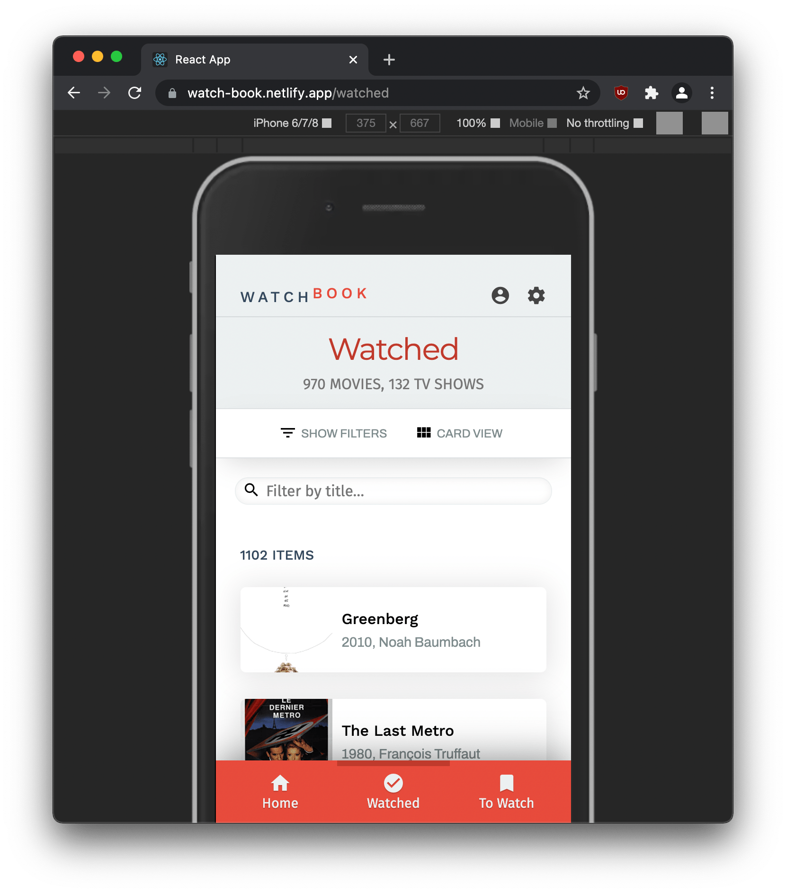
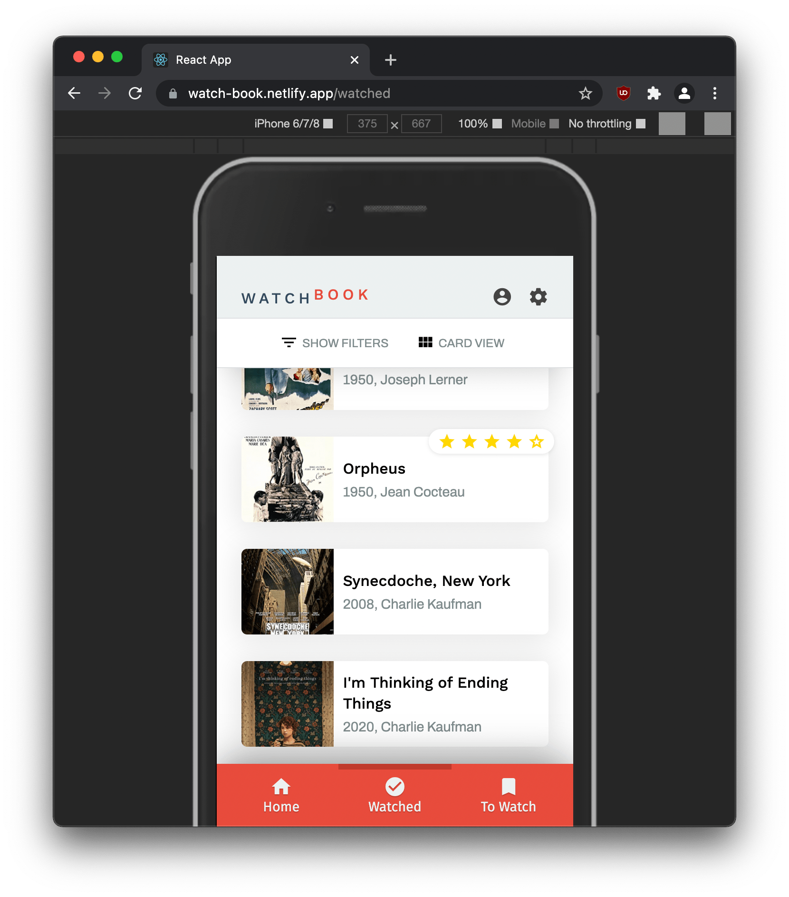
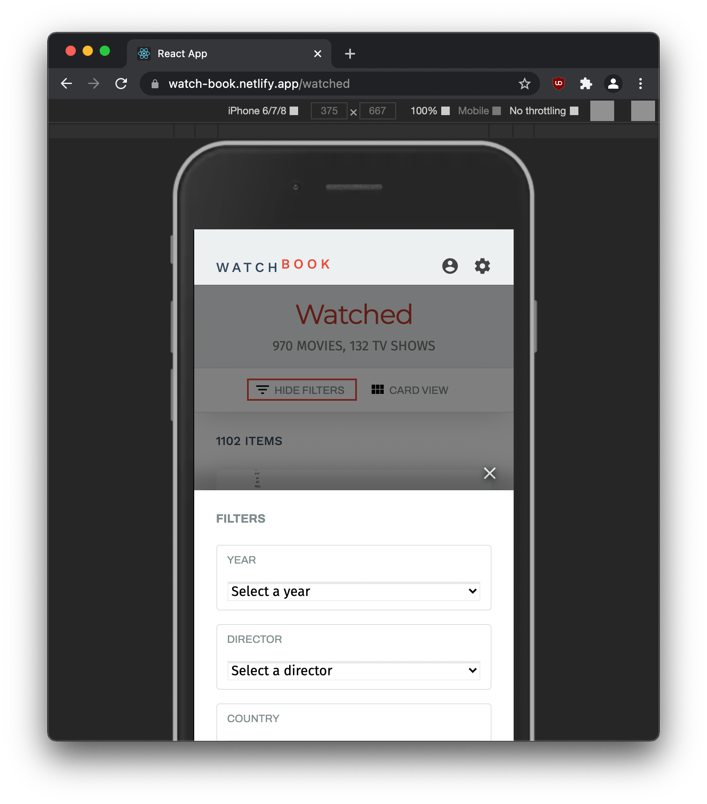

WatchBook
=========

WatchBook is an API-powered watch log for movies & TV shows. The app interfaces with the [OMDB api](https://www.omdbapi.com/) to provide the user with detailed movie/TV Show data.

The user can manage a list of "watched" and "to watch" items, which are displayed in rich media cards and are searchable via fine-grained filters. [&rarr; Watch the demo GIF](./.preview/watchbook-2810.gif)

